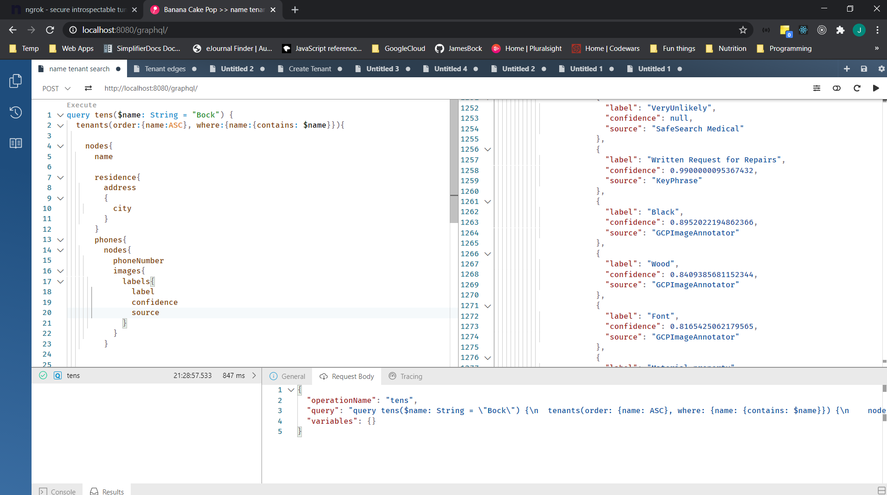
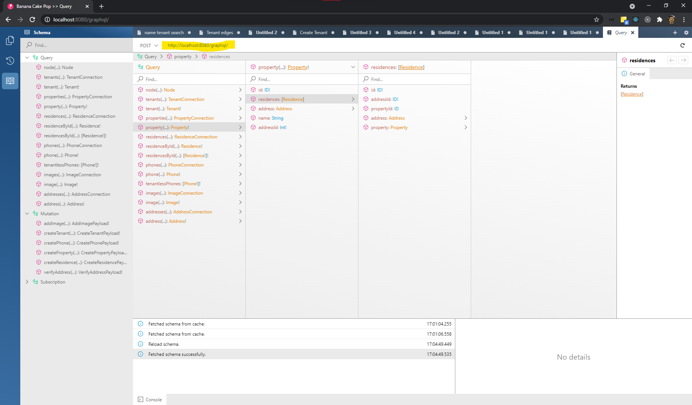

# Tenant File Frontend

## Before running the react-app locally

- You will need node to run the frontend. Currently we're using Node v14 LTS.

  - On macOS and Linux: we recommend using [nvm](https://github.com/nvm-sh/nvm#installing-and-updating), a version manager for node. Once nvm is installed, you can cd into `/BASTA-tfwa/tenant-file/portal-app` and run nvm use. This will install the appropriate version of node (if not already installed), and set your local environment to the specified version.
  - On Windows: node can be downloaded [directly](https://nodejs.org/en/download/) or a seperate [implementation](https://github.com/coreybutler/nvm-windows#this-is-not-the-same-thing-as-nvm) of nvm is available  

- Create a new file named `.env` in `/BASTA-tfwa/tenant-file/portal-app`. This will hold the development environment variables that the app will use to identify the Google Cloud Platform app. It should have this shape:
  >

```txt
NODE_ENV=development
REACT_APP_FIREBASE_API_KEY=
REACT_APP_PROJECT_ID=
REACT_APP_FIREBASE_MESSAGING_SENDER_ID=
REACT_APP_FIREBASE_APP_ID=
REACT_APP_GA_MEASUREMENT_ID=
REACT_APP_API_URL=http://localhost:8080
```

- After setting any environment variable, as you are doing above, you will likely need to close all instances of your code editor for the updates to be propagated
  - To find these values, go to <https://console.firebase.google.com/> and find the project settings then populate them into the `.env` file
- Before running the app for the first time, run command `npm install`
- Run `npm start` to launch the dev version of the app
- Front-end will be running on <http://localhost:3000>

## Using the graphql playground

You can explore the graphql schema and execute database actions by navigation in your browser to <http://localhost:8080/graphql>.

You can use the built in text editor that comes with the grahql server we are using, [Hot Chocolate](https://github.com/ChilliCream/hotchocolate#chillicream-graphql-platform), called Banana Cake Pop to compose queries and mutaions.


For example, this query loads the name, city, phone numbers, and labels for all the images of any Tenant whom has the characters "bock" in their name.

The left panel is the text editor, which generally has the same key-bindings as VS Code! The right displays the results of the database action.

To browse the schema, select the book icon on the left nav bar.


